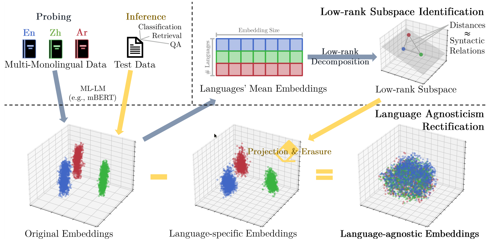

# LSAR: **L**ow-rank **S**ubspaces for language-**A**gnostic **R**epresentations



This repository contains code for our EMNLP 2022 paper:

> Discovering Low-rank Subspaces for Language-agnostic Multilingual Representations
>
> [Zhihui Xie](https://fffffarmer.github.io/), [Handong Zhao](https://hdzhao.github.io/), [Tong Yu](https://scholar.google.com/citations?user=6-ARmXsAAAAJ), [Shuai Li](https://shuaili8.github.io/)
>
> Shanghai Jiao Tong University, Adobe Research
>
> EMNLP 2022

In this work, we propose **LSAR** (**L**ow-rank **S**ubspaces for language-**A**gnostic **R**epresentations), a simple but effective unsupervised method to project away language-specific factors from a multilingual embedding space.
Specifically, LSAR is finetuning-free and keeps the original embeddings space intact.
We systematically evaluate LSAR on various tasks including the challenging language-agnostic QA retrieval task.
Empirical results show that applying LSAR consistently leads to improvements over commonly used ML-LMs.
Here is the [poster](assets/poster.pdf).

## Prerequisites

- Python 3.7+
- Nvidia GPU w/ CUDA
- Anaconda

## Getting Started
### Installation
In order to run experiments, it is also required to install several dependencies using:

```
bash scripts/install_tools.sh
```

Note that to run the experiments of LaBSE, a higher PyTorch version compatible with [transformers](https://github.com/huggingface/transformers) and [sentence-transformers](https://github.com/UKPLab/sentence-transformers) is required. We create another Conda environment with Python3.9 and `torch==1.12.1`, `transformers==4.5.1`,  `sentence-transformers==1.2.1`.

### Preparing the Source Corpora
Run the following command to download the source monolingual corpora (OSCAR and Wikipedia) that are used in the paper for extracting low-rank subspaces:

```
bash scripts/$source/download_$source.sh
```


### Preparing the Datasets
Run the following command to download the datasets (Tatoeba, LAReQA, and Amazon Reviews) used in the paper:

```
bash scripts/$task/download_$task.sh
```

## Reproducing the Results
To reproduce our main results, make sure the source corpora and datasets are already downloaded and then:

- Extract multilingual embeddings by running

    ```
    bash scripts/$source/extract_$source.sh
    bash scripts/$task/extract_$task.sh
    ```
- Evaluate cross-lingual performance of language-agnostic embeddings by running

    ```
    bash scripts/$task/evaluate_$task.sh
    ```

## Acknowledgements
This repository is built on top of [xtreme](https://github.com/google-research/xtreme) and [LIR](https://github.com/ziyi-yang/LIR).
